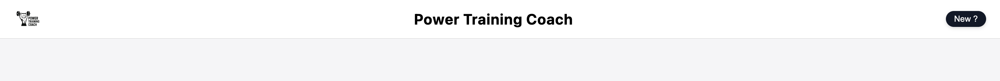
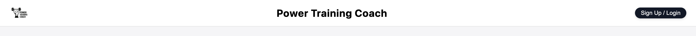
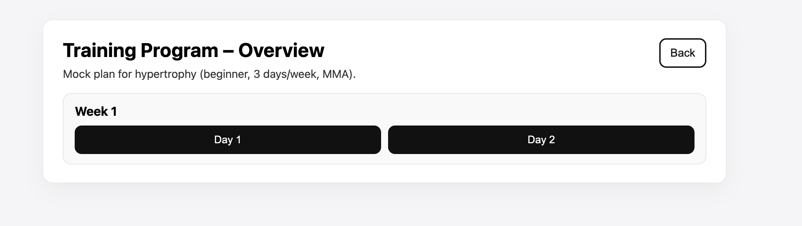
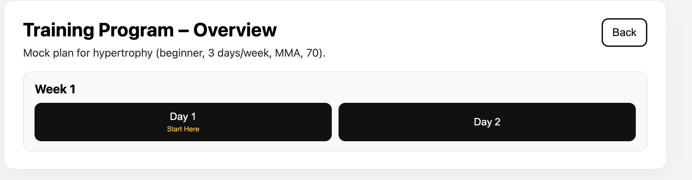
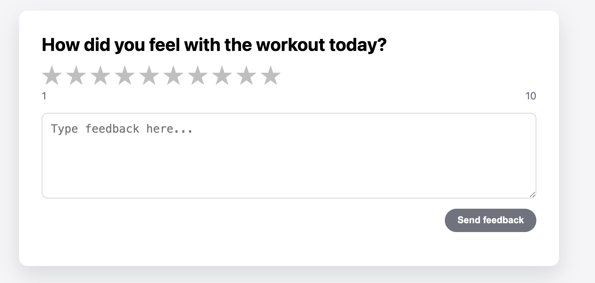
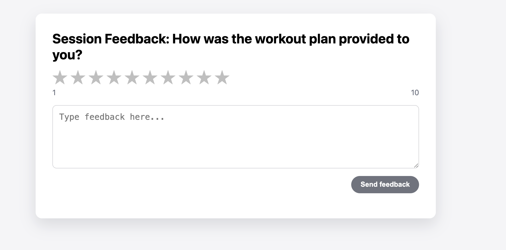

# User Feedback and Design Iterations

This document summarizes the findings from our formative user evaluation session and the specific design changes implemented to address them.

## Evaluation Session
*   **Method**: User Walkthrough / Think-Aloud
*   **Date**: December 21, 2025

---

## 1. Top Bar Navigation Clarity

**Issue Observed:**
The user expressed confusion regarding the labeled button **"New ?"** in the navigation bar. It was not immediately clear that this button was intended for new user registration.

*   *User Quote*: "I had trouble understanding the top bar. what does it mean?"

**Action Taken:**
We renamed the button to **"Sign Up"**. This adopts a standard convention that is instantly recognizable to users as the entry point for account creation.

### Before vs. After
| Before | After |
| :---: | :---: |
|  |  |

---

## 2. Training Plan Flow & Hierarchy

**Issue Observed:**
When presented with the generated training plan, the user did not intuitively immediately start with Day 1. There was confusion about the chronological order, and the user clicked on "Day 2" first. The user also suggested clarifying that the row represents a weekly schedule.

*   *User Quote*: "I didn't understand it was Day 1... I went straight to Day 2."

**Action Taken:**
We added a visual cue to the interface. **Day 1 of Week 1** now features a highlighted **"Start Here"** badge. This visual hierarchy guides the user's focus to the correct starting point immediately upon landing on the overview page.

### Before vs. After
| Before | After |
| :---: | :---: |
|  |  |

---

## 3. Feedback Specificity

**Issue Observed:**
The title and question on the Feedback page were perceived as too vague ("Global"). The user wasn't sure if they were evaluating the application interface, the specific exercise, or the plan generation itself.

*   *User Quote*: "The feedback title is too global, it needs to be more specific."

**Action Taken:**
We updated the question text to be explicit about the context.
*   **Old:** "How did you feel with the workout today?"
*   **New:** "Session Feedback: How was the workout plan provided to you?"

### Before vs. After
| Before | After |
| :---: | :---: |
|  |  |
